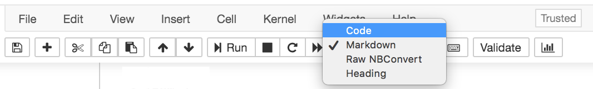
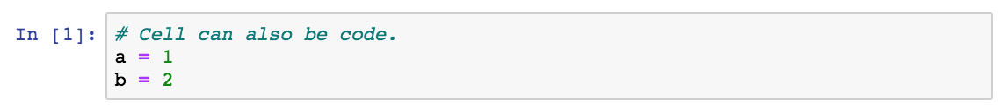
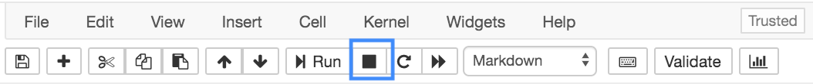

---
redirect_from:
  - "/01-intro/jupyter-notebooks"
interact_link: content/01-intro/jupyter_notebooks.ipynb
kernel_name: python3
title: 'Jupyter Notebooks'
prev_page:
  url: /01-intro/tools
  title: 'Tools'
next_page:
  url: 
  title: ''
comment: "***PROGRAMMATICALLY GENERATED, DO NOT EDIT. SEE ORIGINAL FILES IN /content***"
---

# Jupyter Notebooks

In this chapter, we'll cover Jupyter Notebooks, including how to write and execute code and how to write text in the **Markdown** format. We'll also discuss what the kernel is, so that you understand generally how Jupyter Notebooks work. 

<div class="alert alert-success">
Jupyter notebooks are a way to combine executable code, code outputs, and text into one connected file.
</div>

<div class="alert alert-info">
The official documentation from project Jupyter is available 
<a href="https://jupyter-notebook.readthedocs.io/en/stable/" class="alert-link">here</a>
and they also have some example notebooks 
<a href="https://github.com/jupyter/notebook/tree/master/docs/source/examples/Notebook" class="alert-link">here</a>
.
</div>

## Menu Options & Shortcuts

To get a quick tour of the Jupyter user-interface, click on the 'Help' menu, then click 'User Interface Tour'.

There are also a large number of useful keyboard shortcuts. Click on the 'Help' menu, and then 'Keyboard Shortcuts' to see a list. 

## Cells

<div class="alert alert-success">
    The main organizational structure of the notebook are <b> cells </b>.
</div>

**Cells** are an independent 'unit'. When you click into a cell, you can 'run' it by clicking Shift + Enter, or by pressing the play (Run) button at the top of your notebook. 

Cells come in different types for writing different things - mainly, text or code. 

### Markdown Cells

Cells, can be plain text. In this book, for chapters where code is included, any place you see text - meaning places were we aren'twriting and executing code  - will be written in **Markdown**. 

Markdown is a way to specify all the text formatting you see within the text itself. 

#### _Italics_ & __Bold__

For example, *italicized text* can be specified with an \_underscore\_ or \*single asterisks\*. So, using markdown formatting, that text would appear as follows:

For example, italicized text can be specified with an _underscore_ or *single asterisks*.

**Bold text** requires \_\_two underccores\_\_ or \*\*two asterisks\*\* surrounding the text you would like to bold. Using Markdown formatting, that text would look like this:

**Bold text** requires __two underccores__ or **two asterisks** surrounding the text you would like to bold.


#### Headers

There are a number of different size header you can use with Markdown formatting. The number of pound signs preceeding the header specifies the size of the header.

For example, the following:

```
# Headers are specified with a pound sign
## The more pound signs, the smaller the header
#### But it's still larger
than just plain text.
```

would appear as follows using Markdown formatting:


# Headers are specified with a pound sign

## The more pound signs, the smaller the header

#### But it's still larger

than just plain text.

---

Note that to specify text for a header. the pound sign is followed by a space before the text for the header. The largest header -- specified by 1 pound sign -- is referred to as an H1 header. The second largest, H2, and so on and so forth.

#### Lists

Finally, **lists** are also possible with Markdown formatting. Ordered lists are specified with a number, followed by a decimal point, followed by a space and then the text for the list. For example, the following: 

```
1. numbered item
2. item 2
3. item 3
```

would appear as follows with Markdown formatting:

1. numbered item
2. item 2
3. item 3

Bulleted or unordered lists are also possible. these are specified by either a dash (`-`) or an asterisk (`*`) instead of the number and decimal point. 

For example, either of the following:

```
- item 1
- item 2
- item 3
```

or 

```
* item 1
* item 2
* item 3
```

would appear as follows with Markdown formatting:

- item 1
- item 2
- item 3

### Code Cells

Markdown is really helpful when you want to share text within a Jupyter notebook; however, you're here to learn to program. So let's start talking about code! Whenever you're writing code, you'll want to be sure the cell is set to be a code cell. Within a Jupyter notebook, whenever a cell is selected, you can look at the menu across the top. The drop-down menu will specify what type of cell you're working with.

Here, we see an example of what you would see for a Markdown cell.


To change this cell to a code cell, you would select "Code" from the drop-down menu. You'd then be able to write and execute code from the cell!



The next cell is an example of a code cell. The first line in that cell is a **comment**. Comments are ignored by the computer and are there to help humans reading the code understand what's going on. Comments always start with a pound sign. Note that a pound sign in a Markdown cell indicates something different (a header) than it does in a code cell (a comment).

The second and third line in the example below are lines of Python code! Here we're assigning information to two variables: `a` and `b`. We'll talk all about variable assignment in the next chapter.


{:.input_area}
```python
# Cell can also be code.
a = 1
b = 2
```


#### Running Code

What's important to know now is that Jupyter notebooks don't *just* allow you to write code. You can also **execute the code**. Nothing happens until you execute (or "run") code. 

For example, in the first cell above, that code was typed but never executed. We know that it wasn't executed because to the left of the cell we see `In [ ]:`. 


The empty brackets suggested that this code has not yet been executed.

Once executed, a number will show up within those brackets:



The first code cell you run in a Jupyter notebook will have a `[1]`. The second a `[2]` and so on and so forth.

To execute a cell, you can click on the cell you'd like to run and click "Run" along the toolbar at the top. Or, more likely, you'll want to get in the habit of using hte keyboard shortcut `Shift + Enter` to run your cells. note that `Shift + Enter` will run code cells *and* format Markdown cells.

One important caveat is that if you ever see a `[*]`. to to the left of your code cell, this indicates that the cell is still running. This cann happen if you write code that takes a while to run *or* if you've written code that will run forever (such as an infinite loop).

If this happens and you do *not* want to allow the code to continue to execute (for example, you have an infinite loop and want the code to stop from running, you can click on the square stop icon from the toolbar at the top.



Upon executing the code in a cell, often, there will be some sort of output. The code below says subtract 2 (the value stored in `b`) from 1 (the value stored in `a`) and store that in the variable `c`. Then, the final line here says, print that value out to the screen.


{:.input_area}
```python
# Cells can also have output, that gets printed out below the cell.
c = a - b
print(c)
```


{:.output .output_stream}
```
-1

```

What you see above is why notebooks are so great! They allow explanatory text, python code, *and* the outputs from that code to intermingle in a single document!

Before we move on, one more piece of information about Jupyter notebooks in particular. If the last line of code in a code cell is a variable name, the Jupyter notebook, will print the contents of that varaible to your screen, without you having to put `print()` around it. We'll use this a bunch throughout the book, so it's worth noting now, even though we haven't *exactly* covered what variables are...yet!


{:.input_area}
```python
# if variable last thing in cell
# output will be variable conents
c
```


{:.output .output_data_text}
```
-1
```


#### Cell Order

Ok, so we've discussed that the numbers in the square brackets to the left of a cell show which cells have been run, and in what order and that an asterisk (`*`) means that the cell is currently running. What we haven't yet discussed is that the order in which the cells are run does ***not*** matter to Python or Jupyter notebooks. 

This allows you to flexibly test and develop code. For example, say you've run a few cells of code in order from top to bottom. Then, you realize you wanted a different value in that first code cell. You can go back to that first cell, change it to be the value you want, and then return back to a different cell. Python and Jupyter Notebooks will keep track of whatever was run most recently. 

For beginners and individuals less familiar with working in notebooks, this can sometimes take a bit to get used to, but the benefits of this flexibility outweigh the cognitive load it takes to remember that the order isn't set in stone to go from top to bottom.

## Accessing Documentation

When you're new to Python (or any programming language), knowing where to look for more information is critical. While Google and StackOverflow will likely be very helpful, Python and Jupyter Notebooks have built-in ways for you to access documentation that will provide you with helpful information.

<div class="alert alert-success">
Jupyter has useful shortcuts. Add a single '?' after a function or class get a window with the documentation, or a double '??' to pull up the source code. 
</div>


{:.input_area}
```python
# For example, execute this cell to see the documentation for the 'abs'
abs?
```


## Autocomplete

<div class="alert alert-success">
Jupyter also has 
<a href="https://en.wikipedia.org/wiki/Command-line_completion" class="alert-link">tab complete</a>
capacities, which can autocomplete what you are typing, and/or be used to explore what code is available.  
</div>


{:.input_area}
```python
# Move your cursor to the end of the line, press tab, and a drop menu will appear showing all possible completions
ra
```


{:.input_area}
```python
# If there is only one option, tab-complete will auto-complete what you are typing
ran
```


## Web Browser

<div class="alert alert-success">
Jupyter notebooks display in a web browser. They are not hosted on the web, everything is happening locally. 
</div>

If you click on the url in the browser, you will notice it says 'localhost'. This means it is connected to something locally, on your computer. 

That local connection is to the 'kernel'. 

## Kernels

<div class="alert alert-success">
The 'kernel' is the thing that executes your code. It is what connects the notebook (as you see it) with the part of your computer that runs code. 
</div>

Your kernel also stores your **namespace** - all the variables and code that you have declared (executed). 

It can be useful to clear and re-launch the kernel. You can do this from the 'kernel' drop down menu, at the top, optionally also clearing all ouputs. Note that this will erase any variables that are stored in memory. 

## Exercises

1. What does three underscores around text accomplish?
A) bold  
B) italicize  
C) bold + italicize  
D) plain text    

2. Add a cell to a notebook, change it to be a Markdown cell, and add your name as (1) plain text, (2) italicized text, and (3) bold text.

3. What would happen if I specified a numbered list but put the same number before each list item?
A) the list would have the same number before each item  
B) markdown would still format it with sequential numbers  
C) markdown wouldn't know it was a list  
D) normal text with everything on a single line  

4. Write code in a code cell and execute it so that the value returned from the cell is '6'.

5. If the following were in a code cell, what would be the output of that cell?

```python
a = 1
b = 2
c = 3
print(a + b + c)
```

6. If the following were in a code cell, what would be the output of that cell?

```python
a = 1
b = 2
c = 3
a + b + c
```

7. If the following were in a code cell, what would be the output of that cell?

```python
a = 1
b = 2
c = 3
```
