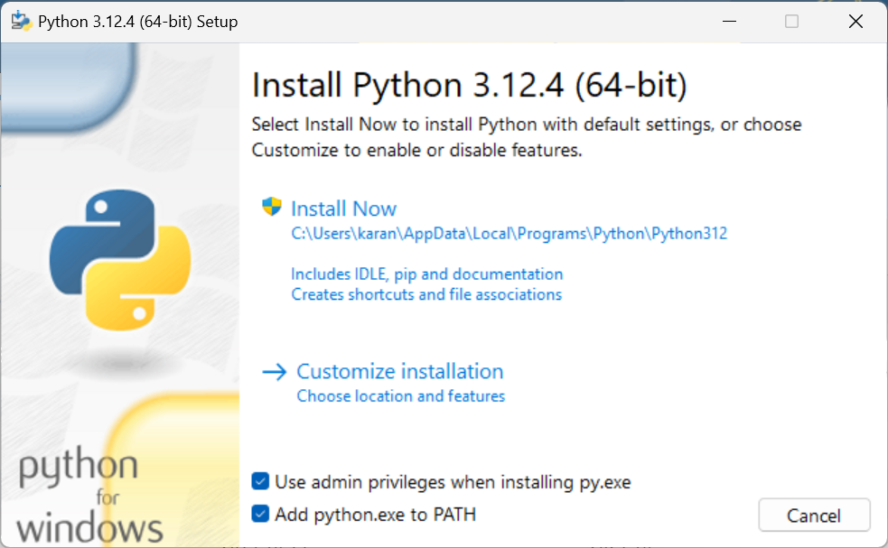

# Installing Python

## Installing Python on a Windows Machine

There are three possible ways to install Python on a windows machine:

1. Through the microsoft store: The most straightforward way to install Python on a windows Machine.

2. Through the Python website: This is the most common way to install Python on a windows machine.

3. Through Anaconda: Anaconda is a distribution of Python that comes with a lot of packages pre-installed. This will include the standard library and additional external packages that we will introduce and use toward the end of the book.

Before we get started, let's check if Python is already installed on your machine. Open your start menu by clicking the `Windows` key on your keyboard. Then type in `powershell` and open the application (if you can't find powershell, type in `command prompt` instead and open that). You should have cool terminal open that makes you feel like a hacker!

In the terminal, type in `python --version` and press enter

If you do not have python installed, you would proceed to install it in one of the following ways.

### Installing Python through the Microsoft Store (Windows 10 or 11)

1. Go to the Microsoft Store from your start menu and search for Python.

   a. You will find multiple versions of Python, but for this course we will be using Python 3.XX

2. Install the python version by clicking the `Get` button.

3. Once installed, go back to `powershell/command prompt` and type in `python --version` or `py --version`to confirm that Python has been installed. If it is installed, you will see something like this:

   

You should be good to go! You now have access to Python in the terminal and Python's IDLE (Integrated Development and Learning Environment).

A quick note about the Microsoft Store install of Python:

According to officials docs from the [Python Software Foundation](https://docs.python.org/3/using/windows.html#the-microsoft-store-package) the Microsoft store installation of python is an easily installable version directed for interactive use cases, specifically for Students. For the purposes of this textbook, the Microsoft Store installation of Python is sufficient, however do note that there are issues with the [redirection of local data, registry and temporary paths](https://docs.python.org/3/using/windows.html#the-microsoft-store-package) that may prevent you from write access to certain file locations. It is unlikely that anything in this textbook will require you to modify any such data, but if you run into this issue, you may want to consider the Full installation of Python through their **official** website which we will highlight below.

### Installing Python through the Python Website

1. Go to the [Python website](https://www.python.org/downloads/)

2. Click on the download button to download the latest version of Python.

3. Launch the installer and you should see a screen that look similar to this:

   

4. Make sure to check the box that says `Add Python to PATH` and click `Install Now`.

5. You should be able to go into Powershell/Command Prompt and type in `python --version` or `py --version` to confirm that Python has been installed.
